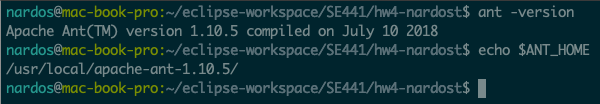
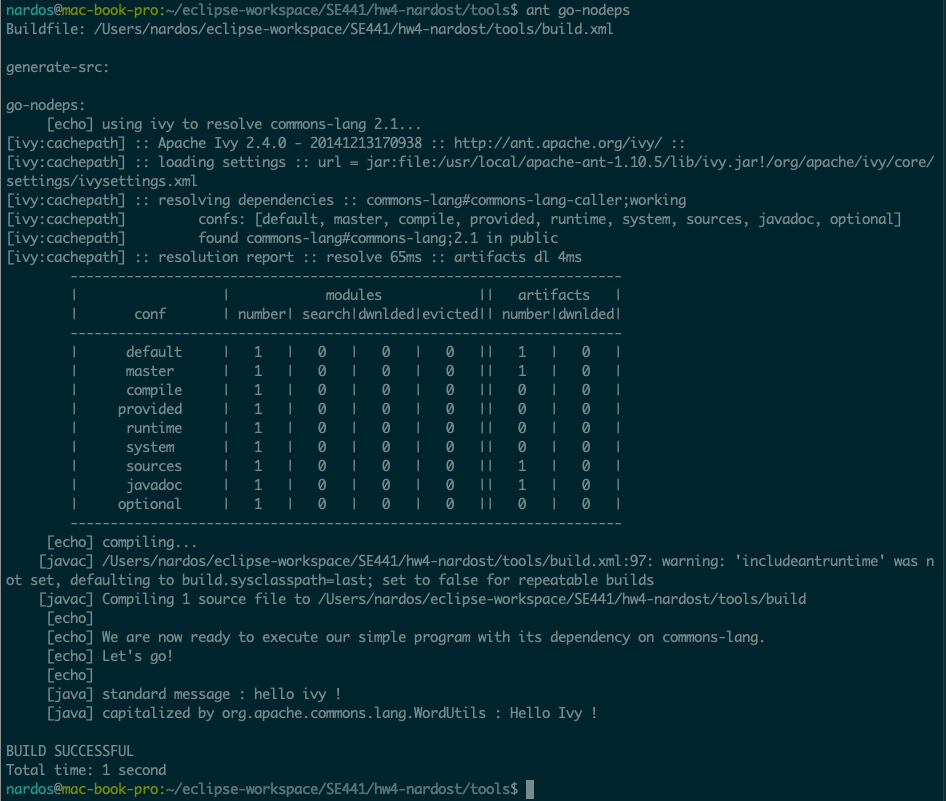
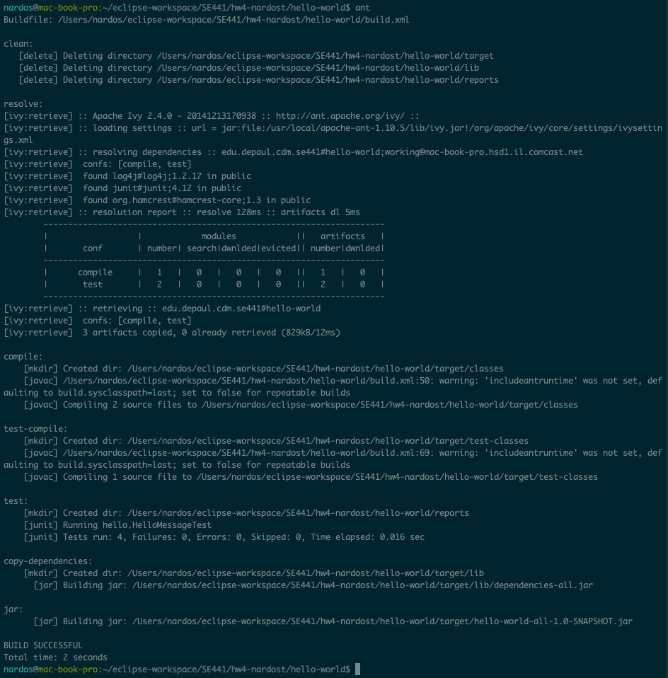
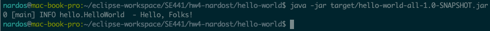
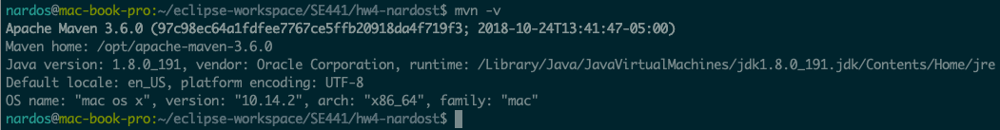
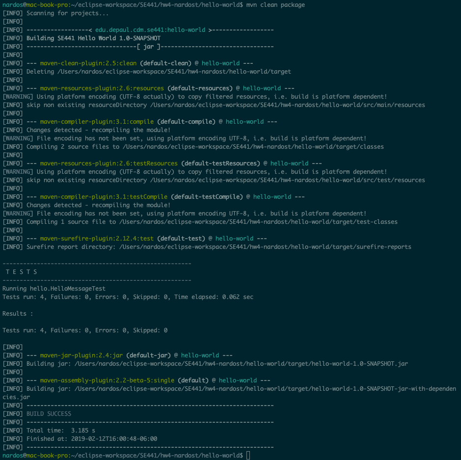
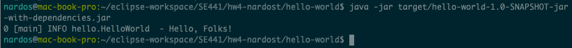
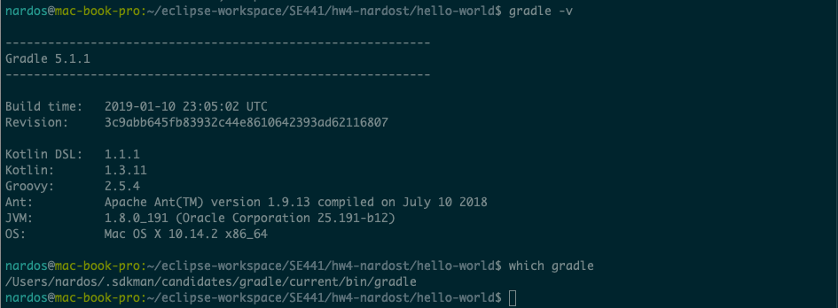
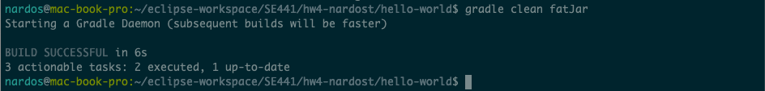
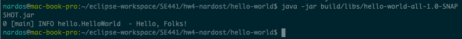

# SE441-HW4
## Nardos Tessema
## ID\#: 1941511

## Ant+Ivy [40 pts]
```
$ant -version
$echo $ANT_HOME
```

```
$ant go-nodeps
```

```
$ant
```

```
$java -jar target/hello-world-all-1.0-SNAPSHOT.jar
```

#### Links to build\.xml and ivy\.xml
* [hello-world/build.xml](hello-world/build.xml)
* [hello-world/ivy.xml](hello-world/ivy.xml) files.

## Maven [30 pts]
```
$mvn -v
```

```
$mvn clean package
```

```
$java -jar target/hello-world-1.0-SNAPSHOT-jar-with-dependencies.jar
```

#### Link to pom\.xml
* [hello-world/pom.xml](hello-world/pom.xml)

# Gradle [30 pts]
```
$gradle -v
$which gradle
```

```
$gradle clean fatJar
```

```
$java -jar build/libs/hello-world-all-1.0-SNAPSHOT.jar
```

#### Link to build\.gradle
* [hello-world/build.gradle](hello-world/build.gradle)
